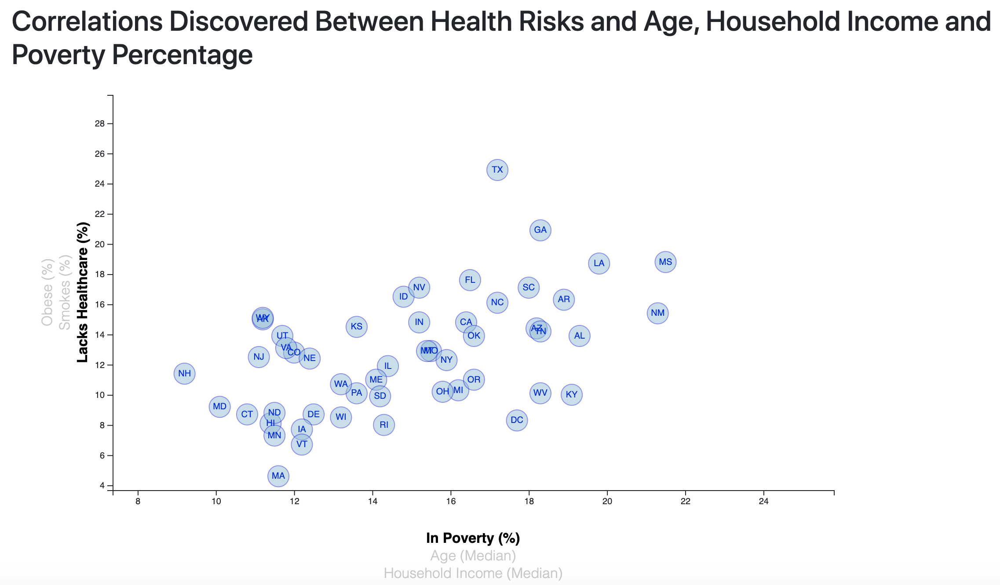
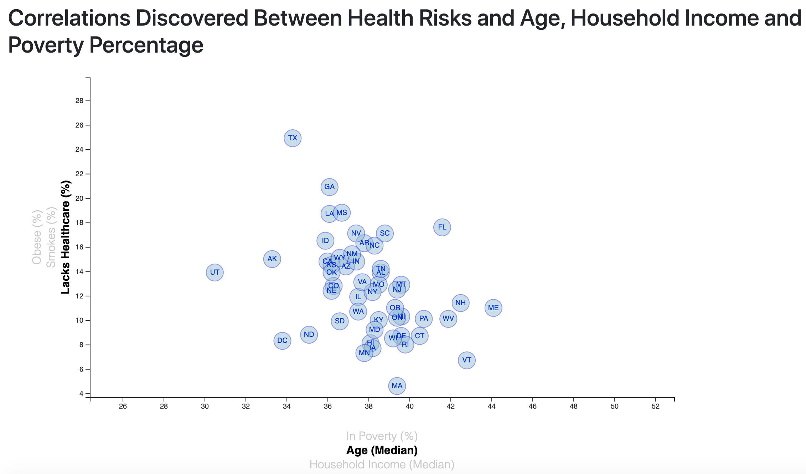
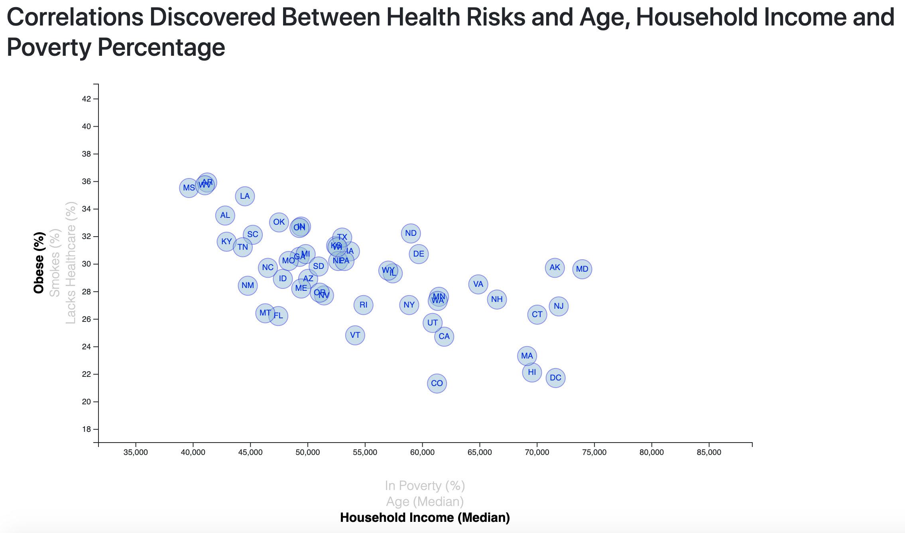
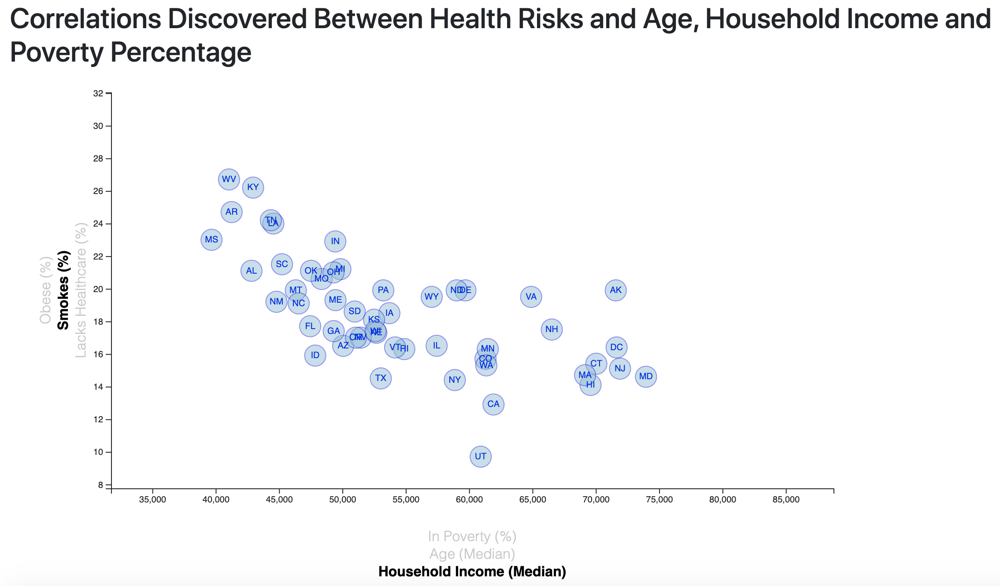
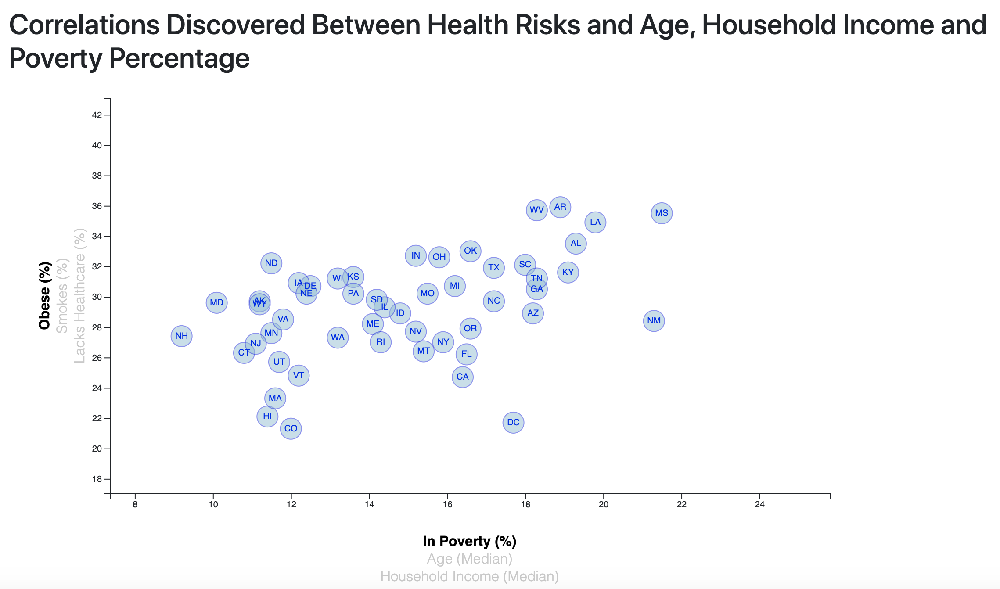
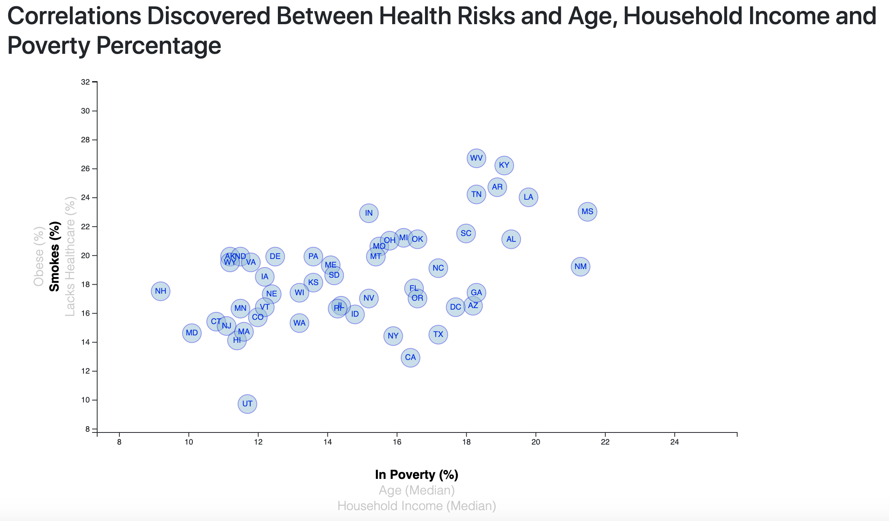
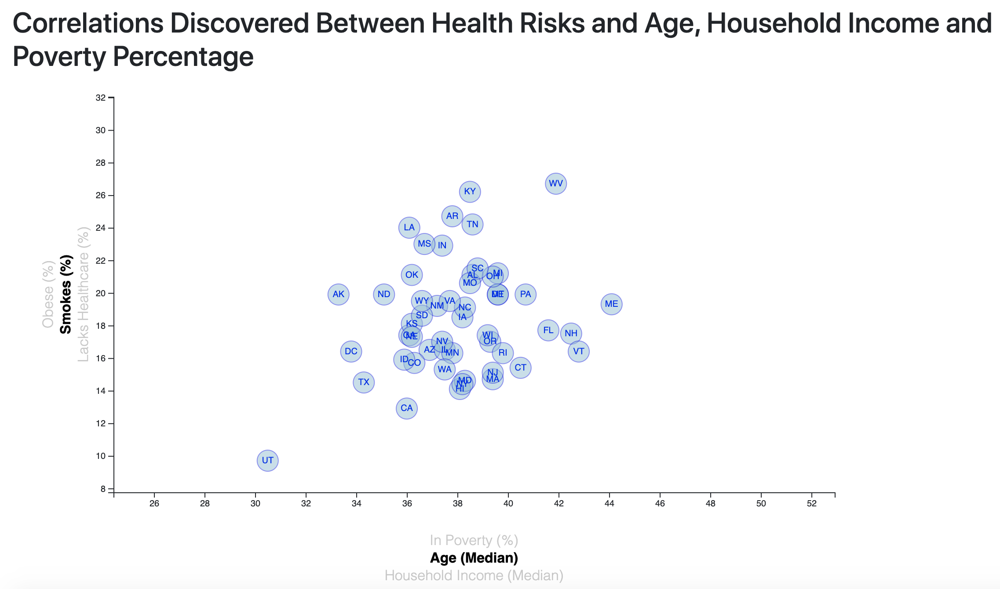
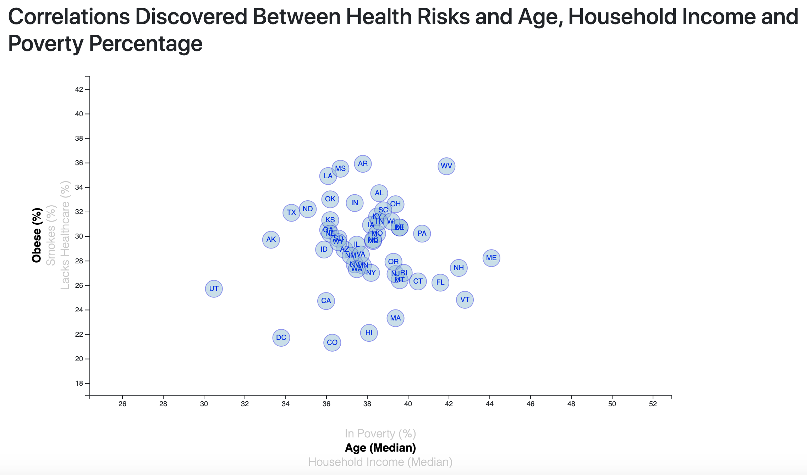
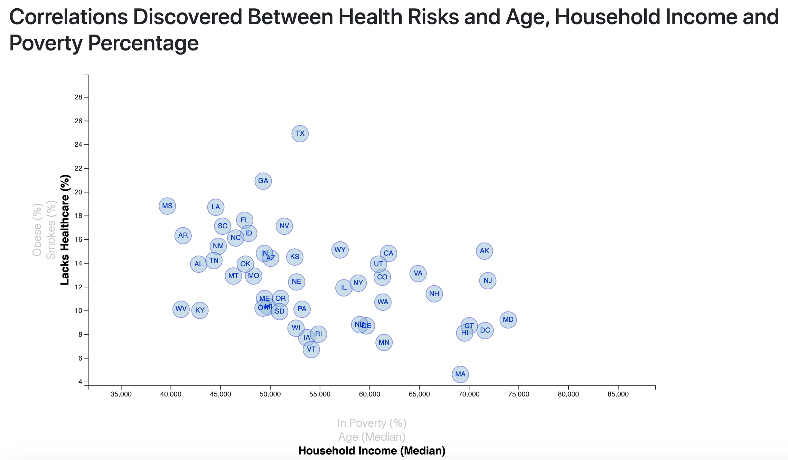

# D3 Challenge

## Overview:
The correlation between lack of healthcare, percentage of smokers, and obesity percentage was compared to poverty percentage, median age and median household income for all states in the U.S. The data was obtained from the U.S. Census Bureau and the Behavioral Risk Factor Surveillance System and the results were visualized using D3. 

## Workflow:

A scatterplot was created within the app.js file using JavaScript and D3. The data was pulled from the data.csv file and the d3.select() function was used to append the graph into the HTML file. CSS was used for both the HTML page styling and the scatterplot styling. D3 was used for animations, transitions, click events on the x and y labels, and tooltips when the cursor hovers over the state circles. 

## Observations:

- When comparing lack of healthcare to poverty, the data is spread across the graph, meaning that there is no direct relationship between percentage of poverty and percentage of people lacking healthcare.

- For most states, people who lack healthcare are within the age range of 36 - 40.

- There is no direct correlation between percentage of smokers, or obesity percentage, and the percentage of poverty and/or median household income. Also, those states with the highest percentage of smokers (or obesity percentage), have the highest percentage of poverty and the lowest median household income

- For most states, people who smoke (or those considered obese) are within the age range of 36 - 40.

- Similarly, there is no direct correlation between median household income and percentage of people lacking healthcare. 

