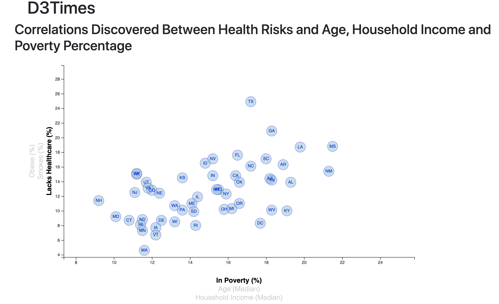

# D3 Challenge

## Overview:
The correlation between lack of healthcare, smoking status, and obesity was compared to poverty, age and household income. The data was obtained from the U.S. Census Bureau and the Behavioral Risk Factor Surveillance System and the results were visualized using D3. 

## Dataset:

## Workflow:

## Observations:

